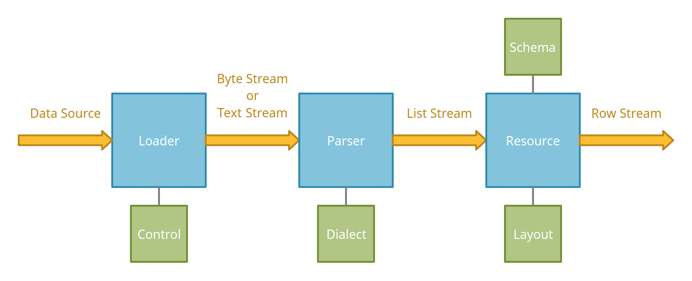

# System/Plugin

This guides provides a high-level overview of the Frictionless Framework architecture. It will be useful for plugin authors and advanced users.

## Reading Flow

Frictionless uses modular approach for its architecture. During reading a data source goes through various subsystems which are selected depending on the data characteristics:



For example for a local CSV file it will use:
- `LocalLoader`
- `CsvParser`

## System Object

The most important undelaying object in the Frictionless Framework is `system`. It's an singletone object avaialble as `frictionless.system`. This object can be used to instantiate different kind of lower-level as though `Check`, `Step`, or `Type`. Here is a quick example of using the `system` object:

```python title="Python"
from frictionless import Resource, system

resource = Resource(path='https://example.com/data/table.csv')

check = system.create_check({'code': 'duplicate-row'})
control = system.create_control(resource, descriptor={'httpTimeout': 1000})
dialect = system.create_dialect(resource, descriptor={'delimiter': ';'})
loader = system.create_loader(resource)
parser = system.create_parser(resource)
server = system.create_server('api')
step = system.create_step({'code': 'table-validate'})
storage = system.create_storage('sql', 'postgresql://database')
type = system.create_type(resource.get_field('id'))
```

As an extension author you might use the `system` object in various cases. For example, take a look at this `MultipartLoader` excerpts:

```python title="Python"
def read_line_stream(self):
    for number, path in enumerate(self.__path, start=1):
        with system.create_loader(Resource(path=path)) as loader:
            for line_number, line in enumerate(loader.byte_stream, start=1):
                if not self.__headless and number > 1 and line_number == 1:
                    continue
                yield line
```

It's important to understand that creating low-level objects in general is more corect using the `system` object than just classes because it will include all the available plugins in the process.
